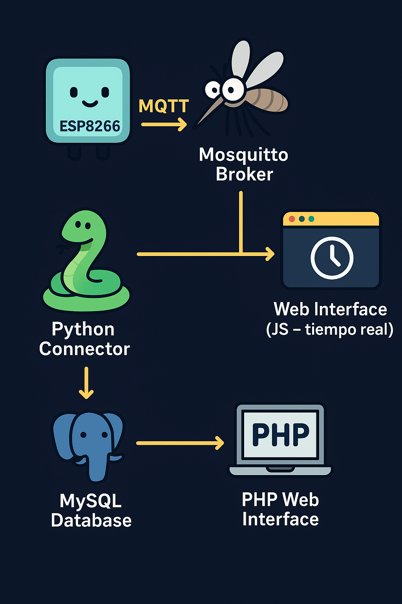

# ACE – Analizador de Consumo Energético

ACE es un proyecto orientado a la lectura, transmisión, almacenamiento y visualización de datos de consumo energético.
Se compone de múltiples módulos que trabajan en conjunto para brindar monitoreo en tiempo real y análisis histórico desde la web.

---

## 📂 Estructura del Proyecto

La estructura actual del repositorio es:

```
ACE/
├─ uC/          # Programas para los microcontroladores
├─ python/      # Conector Python para guardar datos en la base de datos
├─ web/         # Sitio web con PHP, CSS, JS y consultas a BBDD
└─ config/      # Configuraciones y servicios del sistema
```

---

## 🧩 Arquitectura del Sistema

El flujo de datos se puede visualizar de la siguiente forma:

<p align="center">
  
</p>

**Resumen del flujo:**

1. Los microcontroladores (ESP32, RP2040, etc.) toman mediciones eléctricas.
2. Publican los datos en un *broker* MQTT.
3. Un *conector Python* escucha los mensajes y guarda las mediciones en la base de datos.
4. La **web** permite:
   - Consultar datos históricos desde la base de datos mediante PHP.
   - Monitorear valores en tiempo real suscribiéndose al tópico MQTT desde JavaScript.

---

## 🔌 Microcontroladores (Carrito uC)

📍 Ubicación: `uC/`

Contiene los programas para los dispositivos que miden:
- Tensión
- Corriente
- Frecuencia
- Potencia activa/reactiva/aparente

✅ Comunicación mediante MQTT  
✅ MQTT topics: configurables según el canal de medida

---

## 🐍 Conector Python

📍 Ubicación: `python/`

Encargado de:
- Suscribirse a los topics configurados del broker MQTT
- Parsear los datos recibidos
- Insertarlos de manera segura en la base de datos

> En el futuro se planea mejorar validaciones y manejar reconexiones automáticas.

---

## 🌐 Web – Monitoreo y Gráficos

📍 Ubicación: `web/`

Incluye:
- Frontend con HTML, CSS y JS
- Backend con PHP para consultar la base de datos
- Gráficos de consumo y estadísticas
- Monitoreo **en tiempo real** por WebSockets/MQTT

---

## ⚙️ Config & Services

📍 Ubicación: `config/`

Contiene configuraciones del sistema:
- Datos de conexión con el broker MQTT
- Credenciales y parámetros de la base de datos
- Servicios de sistema para automatizar el conector Python

---

## 🚀 Próximas Mejoras

- Nueva UI con dashboards interactivos
- Gestión de usuarios y permisos
- Almacenamiento de configuración desde la web
- Exportación de datos a CSV/Excel
- API REST para acceso externo a métricas

---

## ✨ Autor

Proyecto personal de **Gabriel N.**
Destinado al portfolio profesional y en constante mejora.

---

📌 *Si querés ver la evolución del proyecto con el tiempo, chequeá el historial de commits.*  
